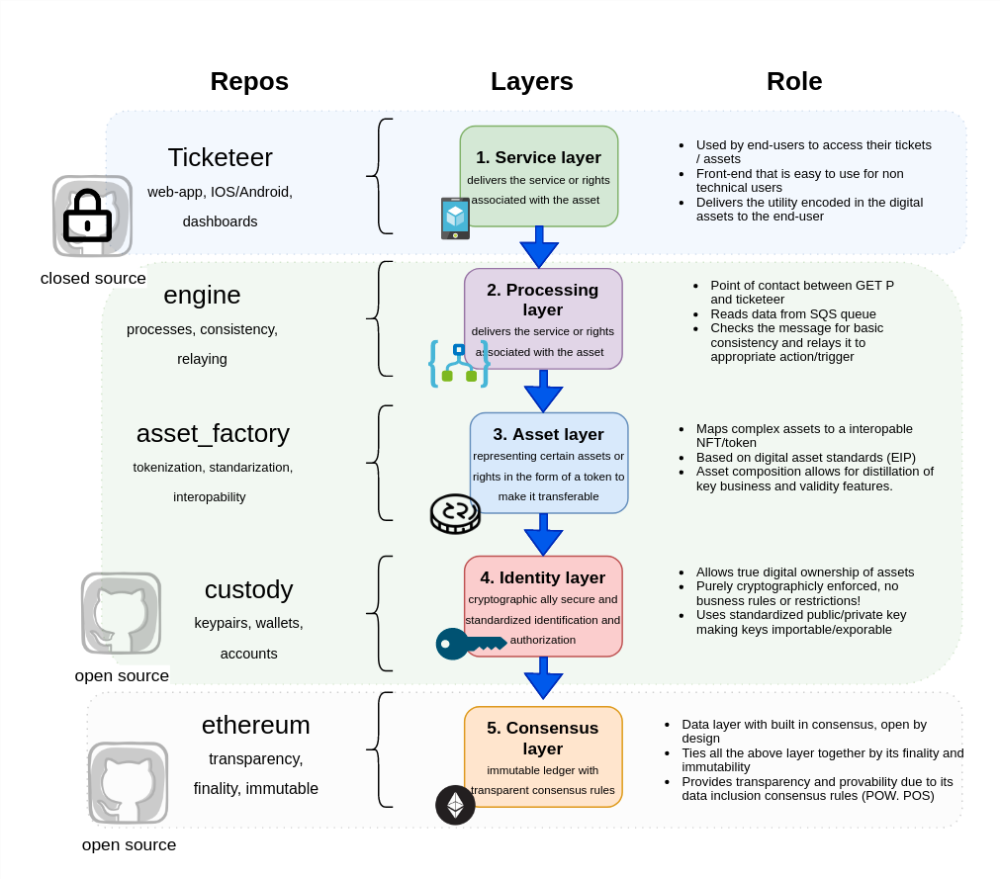
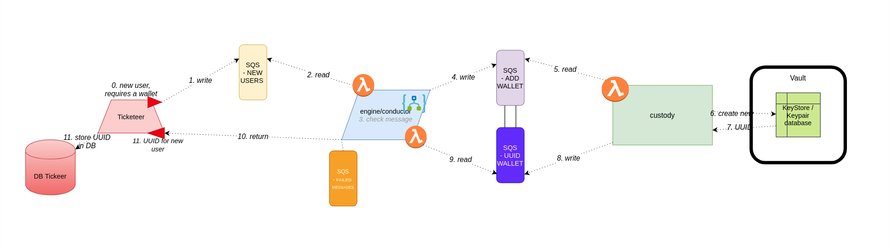
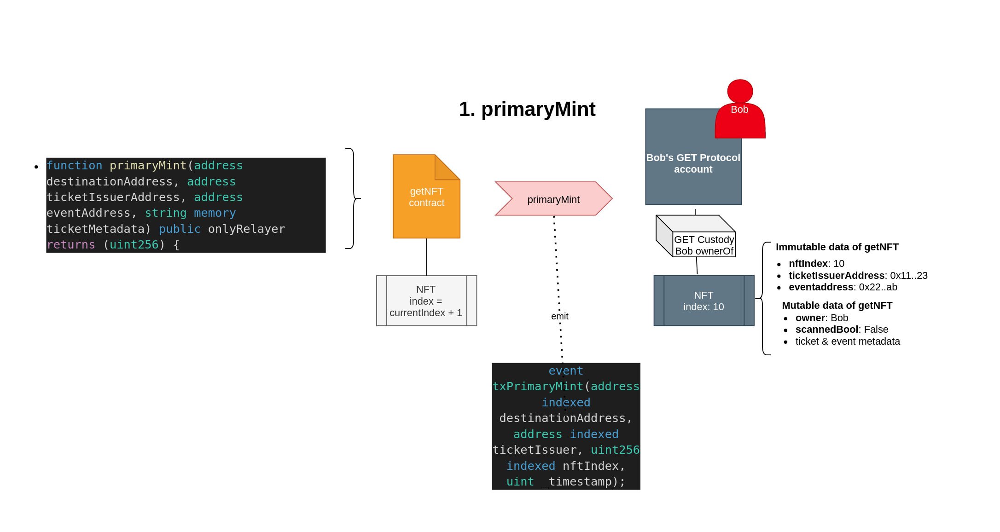
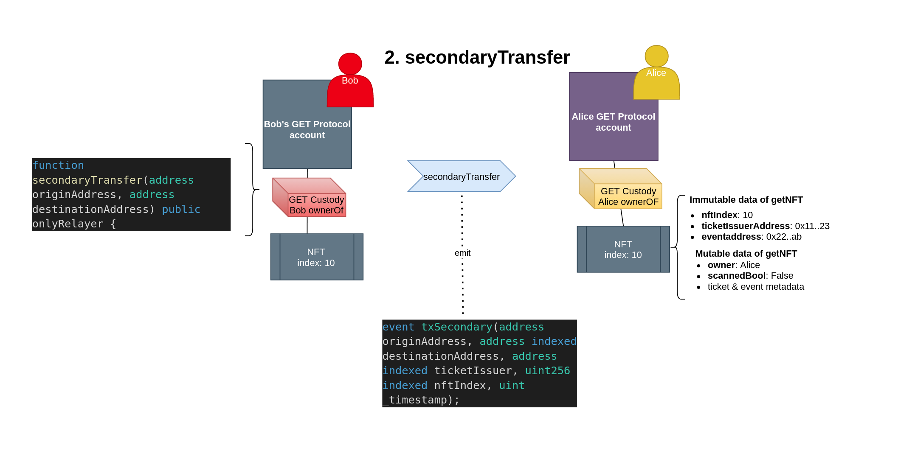
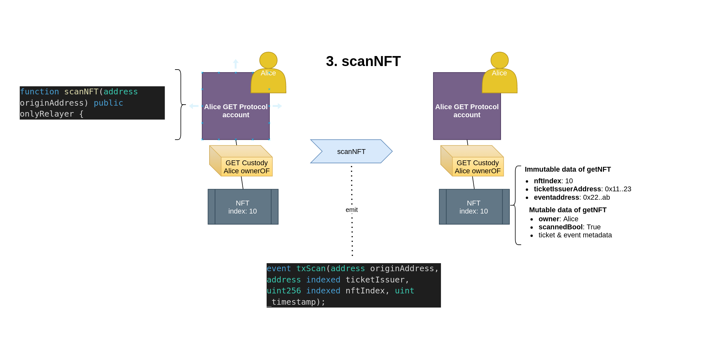

# GET Protocol - General Smart Contract Specification - getNFT
Contract overview and definition of the GET Protocols getNFTs. Allowing P2P trading of smart tickets, lending and more. In this repo the conceptual and achritectual documentation of the GET Protocol is maintained and updated. The code in this repo is only a small part of the tech stack of the GET Protocol.

**High Level Overview GET Protocol**

Custody (the HD wallet infrastructure) and engine (the tx processing and logic board) are still closed-source. This repository is the asset_factory. At the moment the GET Protocol is issuing getNFT assets on the blockchains Ropsten (Ethereum Testnet), BSC Testnet (Binance Smart Chain) and for all Korean ticketing and services the Klaytn Blockchain (mainnet).

## Definition of a getNFT asset
The GET Protocol offers a toolsel to make (event) tickets interoperable, liquid and securitizable. Tickets are digital rights of entry. Hence. the crypto address that owns a getNFT at the moment the event scanning starts, is the entity that will be able to use the ticket to enter the venue. 

The getNFT is thus a transferrable digital right. These tickets/getNFTs will have a value on the secondary market. The contract logic described in the repo, allow for getNFTs to be traded and exchanged between Ethereum/Klaytn/BSC addresses/users.

getNFT is compliant with the ERC721 standard. getNFT adopts the following interfaces:
- IERC721
- IERC721Metadata
- IERC721Enumerable
- IERC721Receiver

Besides the standard function and features the getNFT has several special functions and metadata contracts allowing it to be used for the rather specialized smart ticketing usecase. The code of these custom functions is found in the following contracts:
- ERC721_TICKETING_V2.sol
- MetaDataTE.sol
- OrderbookBuyers.sol
- OrderbookSellers.sol

---

## API Documentation for ticketIssuers (Ticketeers)
The GET Protocol offers for ticketIssuers an API interface to pass on the activity on their systems to the blockchain twin of the issued tickets. Provided links below detail the API interface for ticketeers:

- [GETProtocol getNFT Interface](https://documenter.getpostman.com/view/12511061/TVYKYvVH)

- [GETProtocol getNFT Callbacks](https://documenter.getpostman.com/view/12511061/TVYKYvQo#bd4bcf88-eff9-4341-9eac-71d3f4348b5d)

It is for the public not possible to interact with these API endpoints. getNFTs owners that want to move their getNFTs and that have access to their private keys, are able to use their own wallet to interact with their assets. 



---

### 1. getNFT Asset Specification
The getNFT contract(ERC721_TICKETING_V2) processes all the requests from the getNFT engine. The primary rol of the getNFT engine & its contracts is to manage the exchange/trading of getNFTs as instructed by the `ticketissuer`. 

Note: integrators/ticketissuers do not need to understand or study or adopt this data specification. The getNFT engine will handle all data and convert it in the right format for the getNFT smart contract to process. 

The ticketing usecase requires several custom variables and datafields. The tables below will break down these variables per metadata category. 

###### 1 A. Identity variables specification 
Data fields on ownership of getNFTs. 

| Var | Description | Type  |
| ------ | ------ | ------ |
| *destinationAddress* | The to-be/intended future owner of a getNFT asset. | `address` |
| *originAddress*   | The current/past owner of a getNFT asset. |   `address` |
| *ticketIssuerAddress* | The address of the ticketissuer that has issued the getNFT. | `address` |


###### 1 B. Metadata variables specification
Data fields describing metadata of getNFTs. 

| Var        | Description           | Type  |
| ------ | ------ | ------ |
| *ticketMetadata* | Data field pointing/reference set by ticketissuer (no rules set by protocol). | `string` |
| *eventAddress*   | Address of the event the getNFT asset belongs to set by custody. |   `address` |
| *statusNft* | Metadata field specifying if getNFT is scanned. True = scanned, False = unscanned.  |   `bool` |

###### 1 C. Internal variables specification 
Variables that are used internally in the getNFT contact.

| Var        | Description           | Type  |
| ------ | ------ | ------ |
| *nftIndex*   | Internal reference/pointer to the asset in the smart contract.      |   `uint256` |
| *_timestamp* | Data field pointing to a certain ticket/asset of the issuer. | `string` |
| *onlyRelayer* | Solidity modifier. Only addresses that are registered as a 'relayer' can access this func. |   `msg.sender` (address) |
| *onlyMinter* | Solidity modifier. Only addresses that are registered as a 'relaminteryer' can access this func.  |   `msg.sender` (address) |


---

### 2. getNFT Ownership Functions Specification
The getNFT contract manages the ownership and metadata management of event-assets on-chain. The getNFT engine (and its blockchain nodes) have access to the GET Protocol custody vault. This system holds all the HD wallets derivations of all the users in the system that prefer to have their keys managed by a specialized third party.   

**A.  primaryMint: Issuance of getNFT to address.**
This action is triggered when a ticket is sold to a fan/user. Triggering the creation of the digital twin of the ticket.

**B. secondaryTransfer: Secondary market/P2P getNFT ownership change**
This action is triggered when a ticket is resold/traded between fans.

**C. scanNFT: Validation of getNFT by scanner/issuer**
This action is triggered when a ticket is scanned validated. 

Functions A, B & C can only be called by whitelisted addresses(see section 3 of this documentation covering modifiers). If an getNFT owner wants to interact directly with their NFT, they can use the ERC721 functions (meaning, `safeTransferFrom`, `approve`, `ownerOf` etc). The getNFT is still completely compatable with the ERC271 standard, what makes a getNFT different is that it includes several 'custom' functions that allow ticketIssuers to move getNFTs as the data-base twin of the ticket changes state/hands.  

#### A1. primaryMint (OLD V0)
Mint a new getNFT to a destinationAddress(address of buyer of the getNFT). The function will return the nftIndex (uint256) of the issued getNFT. 
```javascript
    function primaryMint(address destinationAddress, address ticketIssuerAddress, address eventAddress, string memory ticketMetadata) public onlyMinter returns (uint256) {
```

This function will emit the following event to the event-log of the GET Factory contract:   `txPrimaryMint(destinationAddress, ticketIssuerAddress, nftIndex, _timestamp)`.

The values passed in the `ticketIssuerAddress`, `eventAddress` and `ticketMetadata` are stored immutably in the metadata fields of the ERC721 asset.




#### B. secondaryTransfer
If a ticket is resold to a other address this function is triggered. The getNFT custody uses a fresh wallet for each getNFT. The `originAddress` needs to be the owner of a getNFT for this function to be successful. 

```javascript
    function secondaryTransfer(address originAddress, address destinationAddress) public onlyRelayer;
```
This function will emit the following event:  `txSecondary(originAddress, destinationAddress, getAddressOfticketIssuer(nftIndex), nftIndex, _timestamp)`.



#### C. scanNFT
Function that sets the `_nftScanned` metadata field to `true` in the getNFT. This is an immutable action. The getNFT remains transferrable after this action.

```javascript
    function scanNFT(address originAddress) public onlyRelayer;
```
This function will emit the following event:  `emit txScan(originAddress, destinationAddress, nftIndex, _timestamp);`. As of now validating a ticket is immutable. 



---

## 3. Contract Modifiers 
To manage acces the contract uses the RoleManager modules from open zeppelin.  
1. Minter/Admin: Set contract variables, proxy adminstration, add/remove addresses to access control etc.
2. Relayer: Mint NFFs, move NFTs, store metadata in getNFTs etc

In the first versions of the GET Protocol contracts these addresses will be managed and maintained by the GET Protoocol foundation.

---


## 4. getNFT Contract Events Emitted (Ticket Explorer)


*Events emitted by ERC721_TICKETING_V2*
```javascript
    event txPrimaryMint(address indexed destinationAddress, address indexed ticketIssuer, uint256 indexed nftIndex, uint _timestamp);
    event txSecondary(address originAddress, address indexed destinationAddress, address indexed ticketIssuer, uint256 indexed nftIndex, uint _timestamp)
    event txScan(address originAddress, address indexed ticketIssuer, uint256 indexed nftIndex, uint _timestamp);
    event doubleScan(address indexed originAddress, uint256 indexed nftIndex, indexed uint _timestamp);
```

Event log of ERC721_TICKETING_V2:
- `txPrimaryMint`: Primary market ticket sold/issued.
- `txSecondary`: Secondary market ticket traded/shared.
- `txScan`: Ticket scanned/validated.
- `doubleScan`: An already valid ticket was scanned again. 

*Events emitted by MetaDataTE*
```javascript
    event newEventRegistered(address indexed eventAddress, string indexed eventName, uint indexed _timestamp);
    event newTicketIssuerRegistered(address indexed ticketeerAddress, string indexed ticketeerName, uint indexed _timestamp);
```

Event log of MetaDataTE:
- `newEventRegistered`: New event registered in Metadata contract. 
- `newTicketIssuerRegistered`: New ticketIssuer registered in Metadata contract.
- `eventMetaDataUpdated`: TO BE ADDED / NOT YET PRESENT  IN CONTRACT - Metadata of an event was changed/updated.


---

### Deploying the contracts in this repository
WORK IN PROGRESS (commands as stated do not work yet).


```bash
# install dependencies
$ npm install

# deploy contracts (be sure to change the 'from' account in 'truffle.js')
$ truffle migrate --reset --network ganache

# start app
$ npm run dev
```


### Variables changed 
ticketeer = ticketIssuer
_ticketeerAddresss = _ticketIssuerAddresses
_ticketeerAddress = _ticketIssuerAddress
TicketeerStruct = TicketIssuerStruct
allTicketeerStructs = allTicketIssuerStructs
isTicketeer = isTicketIssuer
ticketeerAddress = ticketIssuerAddress
ticketeerAddresses = ticketIssuerAddresses
_markTicketeerAddress = _markTicketIssuerAddress
ticketeerMetaData = ticketIssuerMetadata
newTicketeer = newTicketIssuer
newTicketeerRegistered = newTicketIssuerRegistered