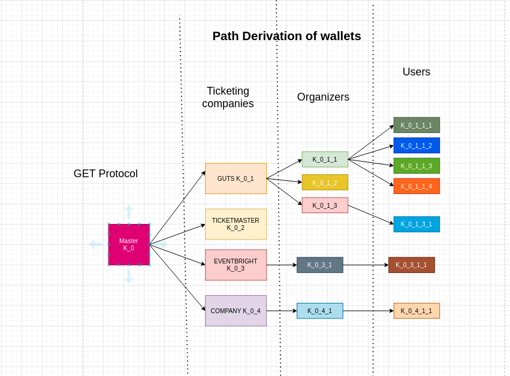

# GET PROTOCOL  - CUSTODY DOCUMENTATION
The getCustody module is an enclosed system that seed wallets. Similar to how a ledger works, all that leaves this enclosed wallet is addresses and signed messages. This module doesn't allow any data exporting in any form.

The diagram below shows a highly simplified overview of how roles are managed. The deriviation tree as showns isn't representive of the actual setup.

The GET Protocol does NOT touch any personal data at any point.

Even though 'NOT TOUCH' is pretty clear language, as it is prvacy and data I will drive this point home.
- No email is collected
- No phone number is collected
- No IP of owner is stored

The only database strucutre the getProtocol operates is its custody solution named getCustody. It stores nothing but seeds and seed derivations. It is effectively stateless as for each new address, a new address is seeded from a certain path. 

## Rotation - How GET Protocol ensures privacy
Address re-use is a privacy risk. Even if we would consider that the data collected by the ticketIssuer is kept safe, the fact that a certain address would own multiple tickets/NFTs (or of several events) could be enough to DOX this person (as there might be only a few people that have bought 20 tickets). Allowing NFT trading and sharing will also expose the identity  of the NFT owner (albeit volutairy this time). 

Both these privacy attacks are unwanted and in some jurisdictions illegal. To ensure our users of privacy each NFT issued will be to a freshly seeded address.

- An address issued by getCustody is used once.
- If a user buys 10 NFTs, these NFTs will 'sit' on 10 different addreses.
- If you as a user buy and sell the same NFT with a friend 10 times, this NFT will have been owned by 20 addresses going on the blockchain data. - This because for each NFT transfer a fresh address is used. 

## Statelss getCUstody
There are a few wallet types that remain consistent over periods of time. These are

- eventAddress -> eventSeed
WIP - TODO

- ticketeerAddress -> tickeerSeed
WIP - TODO

### GET Protocol HD Wallet 

### Ticketeer HD Wallet 

#### Single point of failure
WIP - TODO

The realitiy is that a lot of our clients are technically developed enough to truely understand what it means to hold/own/use a crypographic key. WIP - TODO 

### Moving towards ownership, slowly
Our vision is for the GET Protocol to be truly decentralized in all its facets. Evidently this means that the key-architecture as it is in V1 (where the GET Protocol holds the master-key for all assets). Is not idea. However, this decisiton 

---

## Technical Breakdown of getCustody
WIP - TODO